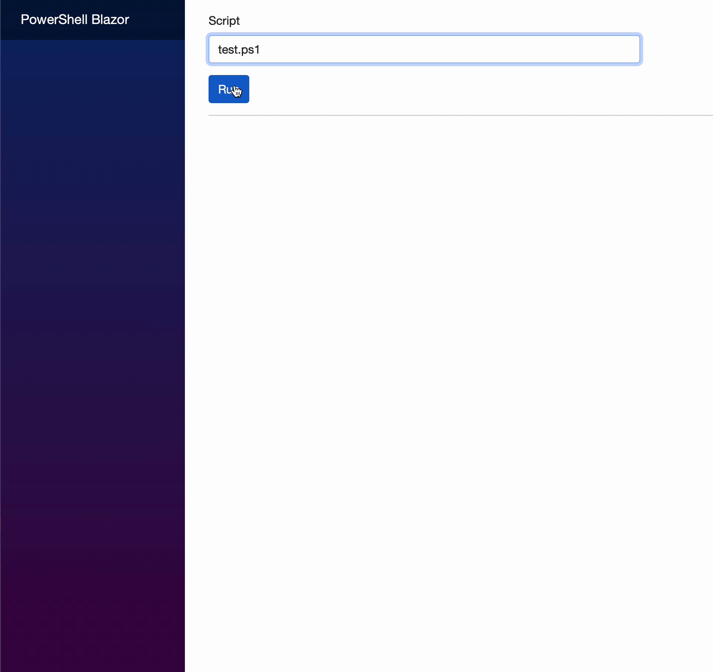

# PowerShell Blazor Portal

Execute PowerShell scripts via .Net Blazor Server WebApp with real-time output

Useful for automation and user accessibility, this is a working .NET Blazor Server WebApp that asynchronously executes PowerShell scripts, and writes the Output, Information, Progress, Warning, and Error streams in real-time.

**test.ps1** (included in this project):
```powershell
for ($i=1; $i -le 5; $i++) {
    Write-Progress "Loop $i - progress output (Write-Progress)"
    Write-Information "Here's some information (Write-Information)"
    Write-Output "Normal output text (Write-Output)"
    Write-Warning "Here's some warning text (Write-Warning)"
    Write-Error "Oh no, here's some error text (Write-Error)"
    Start-Sleep -s 1
}
```
Looks like this...



## Prerequisites

* PowerShell scripts must be non-interactive; there's no means to provide input back to PowerShell scripts once they're running.

* Output must be written using Write-Output, Write-Information, Write-Progress, Write-Warning, or Write-Error only. Output written with Write-Host cannot be captured and hence won't display in the results window.

* Ensure PowerShell Execution Policies have been sufficiently opened to allow scripts to run. If in doubt (and at own risk), as Administrator run:
```powershell
    Set-ExecutionPolicy Unrestricted -Scope CurrentUser
    Set-ExecutionPolicy Unrestricted -Scope Process
```
**Note:** for *Visual Studio* users, **execute the above in Package Manager Console**
    
* Place your PowerShell scripts in **~/Scripts/**. .NET requires the path to be relative to the project, hence this location.

## Author

[Ashley Strahle](https://github.com/AshStrahle)
